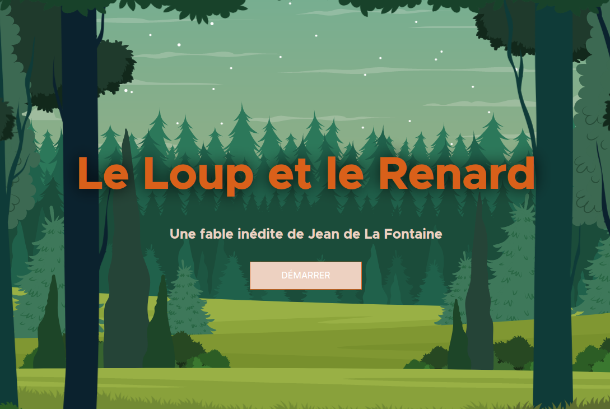
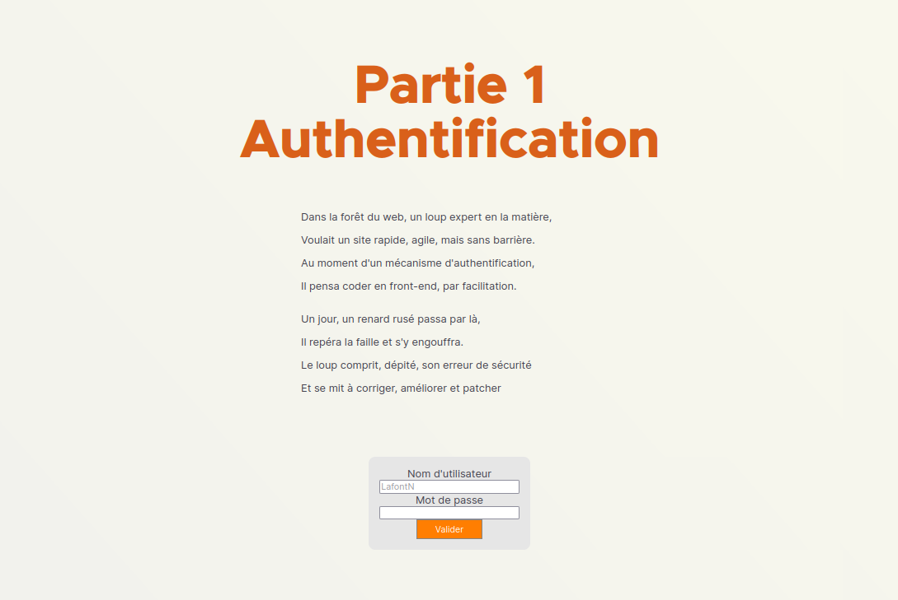
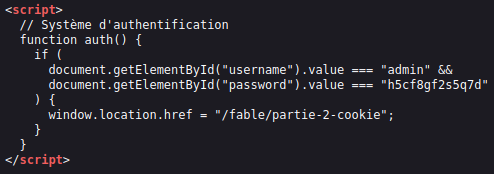
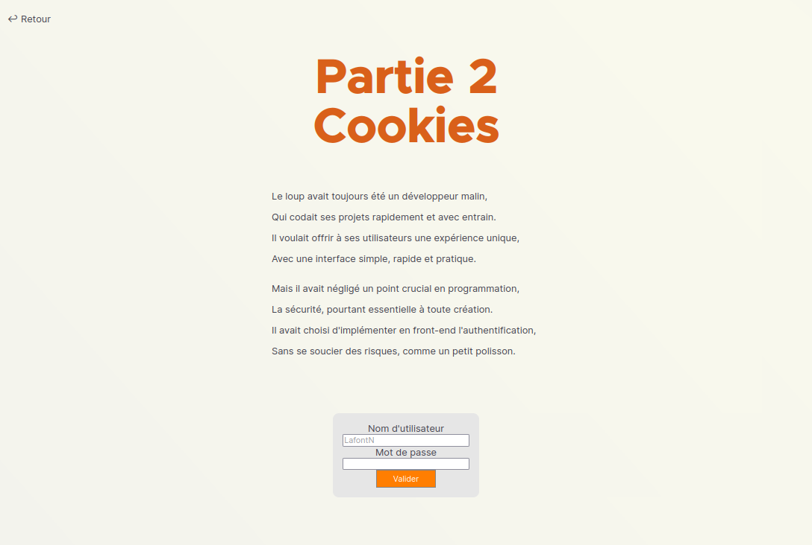
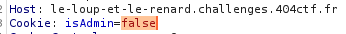
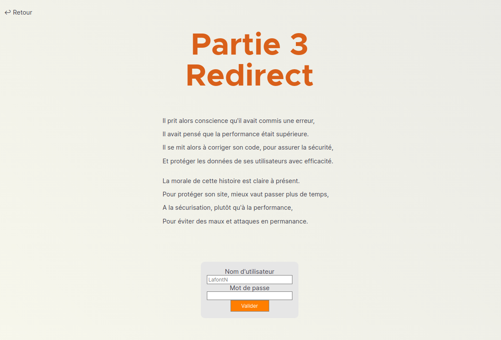
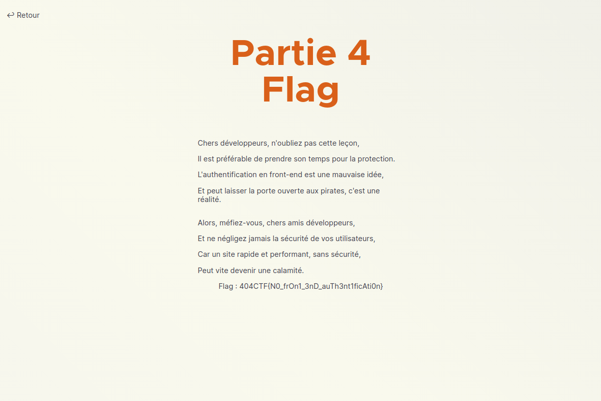

# Reconnaissance

This web challenge allows us to see a first page that takes us to the first part of the challenge named "Authentification"
 
 

# Exploitation

As usual the first thing to do is checking to source code, and we found the credentials we need !

 

Next, the second part called "Cookies".

It's pretty obvious that we have to modify some cookies.. Let's use BurpSuite with the intercept mode ! And bam we found a vulnerable header that we can set to true (two times)

Finally, the last part called "Redirect".

Using Burp with the intercept mode and reloading the page we see that it redirects to the final page containing the flag !

